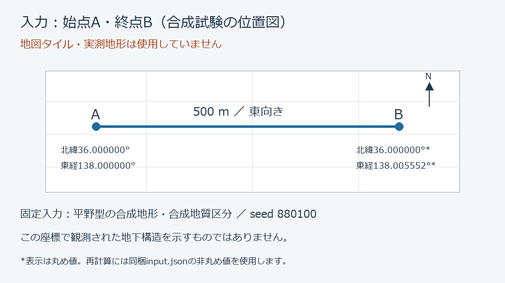
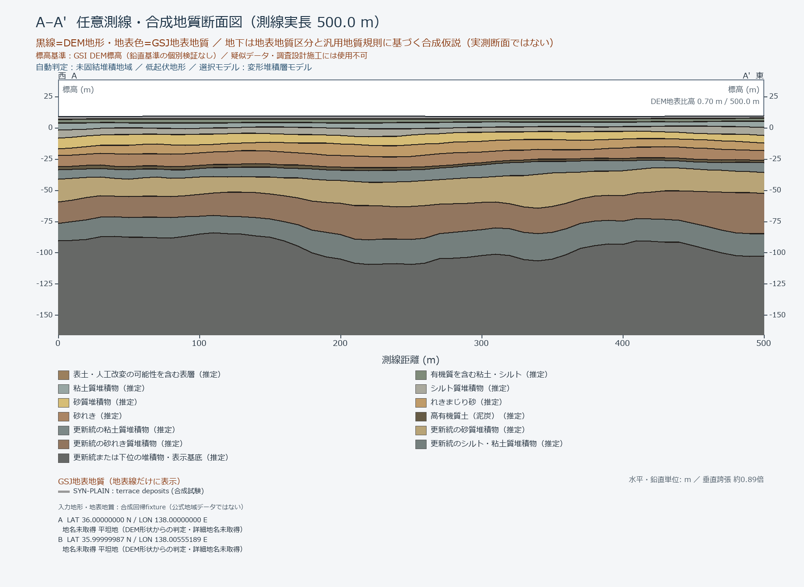

# Geologic Section — Alpha 0.1.0

**地図で二点を選び、地域資料を参照した合成岩相断面をAutoCAD DWGへ出力する実験的ツールです。**

実測地下構造の復元・設計用地質モデルではありません。公開DEM・地表地質から得られる情報と、観測されていない地下の推測を区別します。場所によって生成を拒否します。

## 入力と生成例

| 二点の位置図（説明用・地図タイル不使用） | 実エンジンの出力PNG |
|---|---|
|  |  |

**この例は地形・地質入力とも合成試験データです。実測断面ではありません。** [入力条件・DWG・再現手順はこちら](examples/synthetic_plain/README.md)。実地図からの操作を示すスクリーンショットではなく、入力と出力の関係を示しています。

| できること | 本版ではできない・保証しないこと |
|---|---|
| 地図の二点から断面・DWGを生成 | 円内の全地点での生成成功 |
| 公開地域資料を参照した推測 | 実際の地下構造・層厚の正解 |
| GUI操作と詳細設定 | Nextの高度3D研究機能の自動利用 |
| 自動検査と拒否理由の記録 | 専門家・人間の目視確認の代替 |

## 最初に使う

1. Windows上でフォルダ全体を展開してください。
2. Python 3.11以上（TkinterとWindows Pythonランチャー）とAutoCAD 2027が必要です。開発環境の試験はPython 3.12です。他のAutoCAD版は未検証です。
3. `Geologic_Section.vbs` をダブルクリックします。初回はGUIの「セットアップ」で、このフォルダ専用のPython環境と依存ライブラリを準備します。
4. 地図で始点A・終点Bを選びます。距離は10～500mです。
5. 保存先を確認して「検証してネイティブDWGを生成」。結果はGUIから開けます。

Python自体は同梱しません。地図・地域資料取得と初回ライブラリ導入にはインターネットが必要です。ファイルの一部だけでは動きません。

## できること

- 地図の二点から測線長と方位を計算し、座標・取得できた地名を図面へ記載
- 地形・地表地質を参照し、対応する地質区分の合成断面を生成
- seed、DEM標本間隔、区分線、目盛密度を詳細設定から指定
- 条件の保存・読込、PNGプレビュー、ネイティブDWG保存と再オープン検査
- 条件不適合・資料不足・作図検査失敗を、成功と区別して記録

## この版の位置付け

ユーザーが動作確認した旧二点指定版を基に、研究用GUIと未接続のNext研究モジュールを公開パッケージから除いたアルファ版です。地質生成・判定閾値は変更していません。

**本版の通常経路はAdvanced V2の地域合成断面です。保存3Dボリュームから任意断面を取り出す後続研究版ではありません。** リポジトリ内に再利用基盤として3Dエンジンのコードがあっても、GUIが全機能を呼ぶことを意味しません。複雑な断層・褶曲、柱状図画像からの自動解釈、専門家水準の地域モデルは本版の機能として宣伝しません。

## 制限と安全性

- 円は距離制限です。円内でも混在地質・資料不足・品質ゲートによる拒否があります。
- 地表地質は地下の厚さ・境界位置を観測した証拠ではありません。推測モデルです。
- 地図や取得データの解像度以上の測量精度を主張しません。
- AutoCADの既存プロファイルをインポート・切替する操作はGUI経路で行いません。生成は別のCore Consoleプロセスを利用します。
- 凍結した基盤計算コードと作図ゲートを残しています。成功した保存だけで地質学的妥当性は証明されません。
- 調査・設計・施工判断に使わないでください。人間による図面確認が必要です。

## 資料

- [開発の経緯と設計](docs/DEVELOPMENT_STORY.md)
- [操作手順と拒否理由](docs/USER_GUIDE.md)
- [公開版で残したもの・外したもの](docs/ALPHA_SCOPE.md)
- [検証状況](docs/VALIDATION.md)
- [再現サンプル](examples/synthetic_plain/README.md)
- [外部データ・依存ソフト](THIRD_PARTY_NOTICES.md)

`app/`は内部実装、`tools/`は起動・検証、`results/`は計算記録、`app/dwg/`は生成DWGです。利用者は通常GUIだけを操作します。

MIT License — Copyright (c) 2026 Hirotou Yuusuek。外部データ・AutoCAD・Python依存パッケージにはそれぞれの条件が適用されます。

不具合はGitHubのIssues → New issue →「不具合報告 / Bug report」から報告できます。公開可能な情報だけを記載してください。
